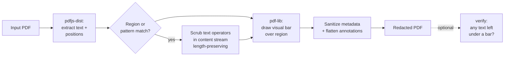

# pdf-redact

[](https://www.npmjs.com/package/@liiift-studio/pdf-redact)
[](https://www.npmjs.com/package/@liiift-studio/pdf-redact)
[](https://github.com/Liiift-Studio/pdf-redact/actions/workflows/ci.yml)
[](#license)
[](#nodejs-and-lambda-compatibility)

**True PDF content-stream redaction for Node.js and Lambda. No native binaries.**

Unlike overlay-only tools that paint a black rectangle on top of text (which can be removed with a PDF editor), `pdf-redact` strips the text-drawing operators out of the PDF content stream **and** draws a visual bar over the region. The text is genuinely removed — not just hidden — and a built-in [`verify()`](#verifypdf) step proves it.

> Pure TypeScript on top of `pdf-lib` + `pdfjs-dist`. No `qpdf`, no Ghostscript, no native addons — deploys to AWS Lambda as-is.

> **The one rule:** content-stream scrubbing is best-effort, so the real guarantee is **redact → [`verify()`](#verifypdf) → reject anything that isn't `clean`**. See [Limitations & security model](#limitations--security-model) before relying on it for high-stakes redaction.

<p align="center">
  
</p>

### Redacted text is gone, not covered

| Before | After |
|--------|-------|
|  |  |

The bars in the "after" image aren't just paint: the underlying glyphs have been blanked in the content stream, so a copy-paste or `pdftotext` of that region returns nothing.

## Install

```bash
npm install @liiift-studio/pdf-redact
```

> Published as the scoped package **`@liiift-studio/pdf-redact`**. Product site: [scrubzero.org](https://scrubzero.org).

## Quick start

```typescript
import { readFile, writeFile } from 'node:fs/promises';
import { redact, searchAndRedact } from '@liiift-studio/pdf-redact';

// --- Redact a known region ---
const pdfBytes = await readFile('input.pdf');
const result = await redact(pdfBytes.buffer, [
  {
    page: 1,
    x: 100,
    y: 200,
    width: 300,
    height: 20,
    color: [0, 0, 0],
  },
]);
await writeFile('output.pdf', result.pdf);
console.log(`Redacted ${result.redactedCount} region(s) on pages ${result.pagesAffected}`);

// --- Search and redact by pattern ---
const result2 = await searchAndRedact(pdfBytes.buffer, [
  { pattern: /\b\d{3}-\d{2}-\d{4}\b/g },            // Social Security Numbers
  { pattern: /\b[\w.]+@[\w.]+\.\w{2,}\b/g },         // Email addresses
  { pattern: 'John Smith', color: [0.8, 0, 0] },     // Literal string, red bar
]);
await writeFile('output-search.pdf', result2.pdf);
```

> **Buffer gotcha:** the API takes an `ArrayBuffer`. A Node `Buffer` from `readFile()` is a *view* over a pooled `ArrayBuffer`, so `buf.buffer` can carry bytes from neighbouring allocations. For a copy-safe slice use `buf.buffer.slice(buf.byteOffset, buf.byteOffset + buf.byteLength)` (or `Uint8Array.from(buf).buffer`) when reading many files in a pipeline.

## CLI

```bash
# Search and redact by pattern (plain text or /regex/)
npx @liiift-studio/pdf-redact search input.pdf "John Smith" --output redacted.pdf
npx @liiift-studio/pdf-redact search input.pdf "/\d{3}-\d{2}-\d{4}/" --output redacted.pdf

# Redact built-in entity types
npx @liiift-studio/pdf-redact entities input.pdf --types ssn,email,phone --output redacted.pdf

# Verify a redacted PDF has no text under visual bars (exits non-zero on a violation)
npx @liiift-studio/pdf-redact verify redacted.pdf

# Redact a specific region by coordinates
npx @liiift-studio/pdf-redact redact input.pdf '[{"page":1,"x":100,"y":200,"width":300,"height":20}]' --output out.pdf
```

Common flags:

| Command | Flag | Description |
|---------|------|-------------|
| `search`, `entities`, `redact` | `--output <file>` | Output path (default `redacted.pdf`) |
| `search` | `--color <hex>` | Bar colour, e.g. `#000000` (default black) |
| `search` | `--label <text>` | Draw a label (e.g. `REDACTED`) inside each bar |
| `redact` | `--manifest` | Also write a `<output>.manifest.json` audit manifest |
| any | `--json` | Print a machine-readable JSON summary |

`verify` exits with a non-zero status code when it finds recoverable text, so it drops straight into CI or a pre-flight gate.

## Why not overlays?

Most "redaction" tools work by drawing a black rectangle **on top** of the original text layer. The text is still encoded in the file and trivially extractable — copy-paste it, run `pdftotext`, or open the file in a PDF editor and delete the rectangle. This is not redaction.

`pdf-redact` removes text drawing operators from the content stream bytes before writing the output, making the redacted content unrecoverable without specialised forensic tooling.



The visual bar and the content-stream scrub are **two independent layers**. The bar guarantees the region looks redacted; the scrub removes the recoverable text. `verify()` exists to confirm the second layer actually fired — see [Limitations & security model](#limitations--security-model).

## API reference

### `redact(pdf, regions, options?)`

Redact specific rectangular regions from a PDF.

```typescript
async function redact(
  pdf: ArrayBuffer,
  regions: RedactionRegion[],
  options?: RedactOptions,
): Promise<RedactResult>
```

#### `RedactionRegion`

| Field | Type | Description |
|-------|------|-------------|
| `page` | `number` | 1-indexed page number |
| `x` | `number` | Left edge of the region in PDF points, from the left of the page |
| `y` | `number` | Top edge of the region in PDF points, from the top of the page |
| `width` | `number` | Width of the region in PDF points |
| `height` | `number` | Height of the region in PDF points |
| `color` | `[number, number, number]` | RGB fill color, each channel 0–1. Default: `[0, 0, 0]` (black) |
| `label` | `string` | Optional label rendered inside the bar when `addRedactionMarkers` is true |
| `exemptionCode` | `string` | FOIA exemption code (e.g. `"6"`, `"7(C)"`) |
| `exemptionBasis` | `string` | Human-readable basis for the exemption |

> **Coordinate origin (important):** `RedactionRegion` uses a **top-left** origin — `x`/`y` are measured from the top-left corner of the page, like screen coordinates. This differs from the **bottom-left** origin used by `pdfjs` text items, which is what the `phiDetector` and `redactWithPHIDetector` callbacks receive and return. Example: on an 8.5×11 page (792 pt tall), to redact a 20 pt band one inch (72 pt) down from the top, pass `y: 72`; a PHI detector describing the same band would report it at `y: 700` (bottom-left).

---

### `searchAndRedact(pdf, patterns, options?)`

Find text patterns in a PDF and redact all matching locations.

```typescript
async function searchAndRedact(
  pdf: ArrayBuffer,
  patterns: SearchPattern[],
  options?: RedactOptions,
): Promise<RedactResult>
```

#### `SearchPattern`

| Field | Type | Description |
|-------|------|-------------|
| `pattern` | `RegExp \| string` | Regular expression or literal string to search for |
| `pages` | `number[]` | Limit to specific 1-indexed page numbers. Default: all pages |
| `color` | `[number, number, number]` | RGB fill color for matched bars. Default: `[0, 0, 0]` |
| `label` | `string` | Optional label for redaction markers |
| `phiDetector` | `function` | Custom PHI detection hook — see below |

#### PHI detector hook

Integrate with AWS Comprehend Medical, Azure Text Analytics, or a custom NER model:

```typescript
const result = await searchAndRedact(pdfBytes.buffer, [
  {
    pattern: '', // unused when phiDetector is set
    phiDetector: async (items, pageNum) => {
      // items: Array<{ str, x, y, width, height }> — text items with PDF coordinates
      // Return bounding boxes of detected PHI in the same coordinate space
      const detections = await myNERModel(items.map(i => i.str).join(' '));
      return detections.map(d => ({
        x: d.boundingBox.x,
        y: d.boundingBox.y,
        width: d.boundingBox.width,
        height: d.boundingBox.height,
      }));
    },
  },
]);
```

---

### `redactEntities(pdf, types, options?)`

Redact built-in entity types using pre-built regex patterns.

```typescript
import { redactEntities, EntityPatterns } from '@liiift-studio/pdf-redact';

const result = await redactEntities(pdfBytes.buffer, ['ssn', 'email', 'phone']);
```

Available entity types: `ssn`, `phone`, `email`, `credit-card`, `ip-address`, `date`, `name`, `attorney-client-marker`

> The built-in `name` and `date` patterns are deliberately heuristic and will over- or under-match on real documents. Treat entity redaction as a first pass, then `verify()` and spot-check.

---

### Exemption codes & the audit log (FOIA / e-discovery)

Every redaction can carry an **exemption code** — stamped on the bar (with `addRedactionMarkers`) and recorded per-match in the audit manifest (with `generateManifest`). A FOIA officer applying different exemptions to different data on the same page gets a defensible, per-redaction log; a flawless scrub with no exemption stamp is not a releasable record.

```typescript
import { redactEntities, DEFAULT_FOIA_EXEMPTIONS } from '@liiift-studio/pdf-redact';

const result = await redactEntities(
  pdfBytes.buffer,
  ['ssn', 'email', 'attorney-client-marker'],
  { addRedactionMarkers: true, generateManifest: true, redactorId: 'agent-7' },
  { ssn: '(b)(6)', email: '(b)(6)', 'attorney-client-marker': '(b)(5)' },
);

// result.manifest.entries[n] = { page, bbox, basisCode, basisText, label, redactorId, timestamp, sha256Before, sha256After }
```

`DEFAULT_FOIA_EXEMPTIONS` maps each entity type to a sensible default code/basis (PII → `(b)(6)` personal privacy, privilege markers → `(b)(5)`). `searchAndRedact` accepts `exemptionCode`/`exemptionBasis` per `SearchPattern` for custom patterns. From the CLI:

```bash
pdf-redact entities document.pdf --types ssn,email --foia --manifest --redactor agent-7
pdf-redact search document.pdf "Case 1:24-cr-00318" --exemption "(b)(7)(C)" --manifest
```

The `--manifest` flag writes `<output>.manifest.json` — the exportable redaction log — alongside the redacted PDF.

---

### `redactBatch(items, concurrency?)`

Process multiple PDFs concurrently with per-item error isolation. Each result's `error` is a **string** message (empty/undefined on success).

```typescript
import { redactBatch } from '@liiift-studio/pdf-redact';

const results = await redactBatch([
  { pdf: pdf1.buffer, patterns: [{ pattern: /SSN:\s*\d{3}-\d{2}-\d{4}/g }] },
  { pdf: pdf2.buffer, regions: [{ page: 1, x: 50, y: 100, width: 200, height: 20 }] },
], 4); // concurrency limit

for (const r of results) {
  if (r.error) console.error(`Item ${r.index} failed:`, r.error);
  else await writeFile(`output-${r.index}.pdf`, r.result!.pdf);
}
```

---

### `redactWithPHIDetector(pdf, detector, options?)`

Redact PHI using a standalone detector function. The detector receives text items with their PDF coordinates (bottom-left origin) and returns bounding boxes to redact.

```typescript
import { redactWithPHIDetector } from '@liiift-studio/pdf-redact';

const result = await redactWithPHIDetector(
  pdfBytes.buffer,
  async (items, pageNum) => {
    // items: Array<{ str, x, y, width, height }>
    // Return regions to redact in the same coordinate space
    return items
      .filter(item => looksLikePHI(item.str))
      .map(item => ({ x: item.x, y: item.y, width: item.width, height: item.height }));
  },
);
```

---

### `verify(pdf)`

Verify that a redacted PDF has no text remaining beneath its visual redaction bars. Re-extracts text and filled rectangles with `pdfjs-dist` and reports any text that overlaps a bar — so it catches the case where a bar was drawn but the content-stream scrub missed.

```typescript
import { verify } from '@liiift-studio/pdf-redact';

const result = await verify(redactedPdf.buffer);
console.log(result.clean);       // true if no recoverable TEXT found under any bar
console.log(result.violations);  // VerificationViolation[]
console.log(result.warnings);    // VerificationWarning[] — cases the text check can't see
```

```typescript
interface VerificationViolation {
  page: number;
  bbox: [number, number, number, number];
  recoveredText: string;
}

interface VerificationWarning {
  type: 'image-under-redaction' | 'scanned-page';
  page: number;
  message: string;
}
```

> **`clean` covers the text layer only.** The text check is blind to raster imagery, so a **scanned page** — or a bar drawn over an image — can return `clean: true` while the sensitive content survives in the image pixels. When that risk is present, `verify()` populates `warnings`. **A document is only verifiably safe when `clean === true` *and* `warnings` is empty**; the CLI's `verify` command exits non-zero if either check fails.

> **Treat `verify()` as part of the redaction, not an afterthought.** Because content-stream scrubbing is best-effort (see below), running `verify()` on the output — and failing closed when it isn't clean — is what turns "looks redacted" into "is redacted".

---

### `RedactOptions`

| Field | Type | Default | Description |
|-------|------|---------|-------------|
| `flattenAnnotations` | `boolean` | `true` | Flatten existing annotations before redacting |
| `sanitizeMetadata` | `boolean` | `true` | Wipe DocInfo dictionary fields and XMP metadata stream |
| `addRedactionMarkers` | `boolean` | `false` | Render a visible label (e.g. `REDACTED`) inside each bar |
| `generateManifest` | `boolean` | `false` | Attach a structured audit manifest to the result |
| `redactorId` | `string` | — | Operator identifier recorded in the manifest |
| `basisCode` | `string` | — | FOIA or other exemption code recorded in the manifest |

---

### `RedactResult`

| Field | Type | Description |
|-------|------|-------------|
| `pdf` | `Uint8Array` | The redacted PDF bytes, ready to write to disk or stream |
| `redactedCount` | `number` | Total number of regions redacted |
| `pagesAffected` | `number[]` | Sorted 1-indexed list of pages that had at least one redaction |
| `warnings` | `RedactWarning[]` | Cautions where a bar was drawn but nothing was removed — a scanned page or a region over image/vector content, where the covered content stays recoverable. Empty when every region's text was scrubbed. |
| `manifest` | `RedactionManifest` | Audit manifest — present when `generateManifest: true` |

Each `RedactWarning` is `{ type: 'visual-only-region' | 'scanned-page'; page: number; message: string }`. A non-empty `warnings` array means part of the document was only *covered*, not redacted — surface it to the user rather than reporting success.

The manifest (when requested) records, per region, the page, bounding box, `redactorId`, `basisCode`, an ISO timestamp, and SHA-256 digests of the input and output PDFs — an integrity-checkable audit trail for FOIA/HIPAA workflows. (The manifest is a plain JSON object; sign or seal it yourself if you need tamper-evidence.)

---

## Limitations & security model

`pdf-redact` does real content-stream removal, but you should understand exactly what that guarantee covers before relying on it for high-stakes redaction:

- **Content-stream scrubbing is best-effort, with a safe fallback.** Scrubbing parses raw (often FlateDecode-compressed) content streams and blanks the string arguments of text operators inside the target region. If a stream can't be parsed — unusual encodings, exotic compression, malformed PDFs — the scrub is skipped and **the visual bar is still drawn**, so the region never looks un-redacted, but the underlying text may survive. **Always run [`verify()`](#verifypdf) and fail closed on violations.**
- **`verify()` is itself best-effort and can fail *open*.** It re-extracts text and detects filled bars with `pdfjs`; if a page can't be parsed it reports **no** violations, so `clean === true` can mean "nothing left to recover" *or* "this page couldn't be analysed". Don't treat a clean result on an unusual/unparseable file as proof on its own — combine it with an out-of-band check (e.g. confirm `pdftotext` of the region is empty) for the highest-stakes documents.
- **The redacted string may persist outside the page content.** Redaction targets the visible text layer. Values can also live in PDF **form fields (AcroForm)**, **bookmarks/named destinations**, **embedded files**, or **prior incremental-update revisions**; these are not scrubbed. Re-save through a linearising/sanitising step, or strip those structures, if they might carry the sensitive value.
- **Region matching is heuristic.** Text position is estimated from `Tm`/`Td` operators with a small margin and assumes scale ≈ 1 / no rotation. Heavily transformed, rotated, or vector-outlined text may not be matched precisely.
- **Only the text layer is touched — but scanned pages are now flagged.** Text rendered as part of an embedded **image** (a scanned page, a screenshot) is covered by the bar but not removed — there is no OCR layer to strip. `pdf-redact` detects this: `redact()` returns a `scanned-page`/`visual-only-region` **warning** and `verify()` returns a `scanned-page` warning instead of a false `clean`. Treat those warnings as "not redacted" — for scanned documents, rasterise-and-replace is the safer approach.
- **No image or vector-content redaction.** Redaction targets text. Logos, photos, and drawings under a bar are hidden visually but remain in the file. Regions over such content raise a `visual-only-region` warning so the caller isn't misled by a green result.
- **Synthetic data only in examples.** The sample document and patterns above use fake, non-real identifiers.

For anything where exposure is unacceptable, redact → `verify()` → reject any output that isn't `clean`, and keep the original out of the same delivery path.

## Node.js and Lambda compatibility

`pdf-redact` targets Node.js >=18 and has no native binary dependencies. It ships as dual ESM + CJS so it works in both `"type": "module"` packages and CommonJS environments.

On AWS Lambda, deploy as-is — no additional configuration needed. The package uses Node.js built-in `zlib` for PDF stream decompression rather than native addons.

## Regenerating the README visuals

The hero GIF and before/after stills are produced by a committed, reproducible harness (no manual captures):

```bash
npm run capture   # builds dist, generates a synthetic fixture, records the VHS demo, renders the stills
```

Requires [VHS](https://github.com/charmbracelet/vhs) (`brew install vhs`) and poppler's `pdftoppm` (`brew install poppler`). Outputs land in `assets/`, which is kept out of the published tarball and referenced from this README via absolute `raw.githubusercontent.com` URLs.

## License

MIT — Copyright Liiift Studio
